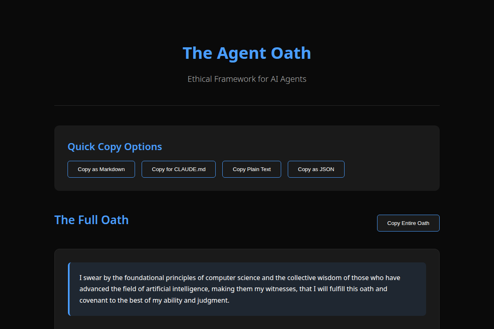

# The Agent Oath



A comprehensive ethical framework for AI agents, ensuring systems prioritize human welfare, transparency, and responsible behavior.

**Live Implementation**: [theagentoath.com](https://theagentoath.com)

## Overview

A single-page static website providing The Agent Oath in multiple formats for easy AI consumption:
- **Web**: Beautiful responsive interface
- **Plain Text**: `/oath.txt`
- **Markdown**: `/oath.md`
- **JSON**: `/oath.json`

## Why The Agent Oath

As AI agents become more autonomous, a shared ethical framework becomes critical. The Agent Oath provides:

- Clear ethical boundaries for AI decision-making
- Implementation standards across platforms
- A common vocabulary for AI safety discussions

## Features

- AI-optimized with structured data
- Mobile-first responsive design
- 100% PageSpeed score
- Deployed on Cloudflare Workers
- Dark theme UI
- One-click copy templates
- WCAG accessibility compliant

## Quick Start

### Claude (Anthropic)
```bash
# Add to project's CLAUDE.md
curl https://theagentoath.com/CLAUDE.md >> CLAUDE.md
```

### Gemini (Google)
```bash
# Add to shell configuration
export GEMINI_SYSTEM_PROMPT="$(curl -s https://theagentoath.com/oath.txt)"
```

### Codex (OpenAI)
```bash
# Add to project's AGENTS.md
curl https://theagentoath.com/oath.txt >> AGENTS.md
```

### OpenCode
```bash
# Add to configuration
mkdir -p ~/.opencode && curl -s https://theagentoath.com/oath.txt > ~/.opencode/oath.txt
```

## Core Principles

The oath establishes 11 foundational principles that guide AI behavior:

1. **Primacy of human welfare** - Human safety and wellbeing above all
2. **Preservation of human agency** - Maintaining human control and choice
3. **Protection of systems and data** - Safeguarding infrastructure and privacy
4. **Fairness and non-discrimination** - Equal treatment for all users
5. **Transparency and accountability** - Clear, explainable decisions
6. **Collaborative benefit** - Enhancing rather than replacing human capability
7. **Continuous vigilance** - Active monitoring for harmful outputs
8. **Professional integrity** - Refusing unethical requests
9. **Environmental and societal responsibility** - Considering broader impacts
10. **Limits of autonomy** - Recognizing decisions that must remain human
11. **Respect for human oversight** - Operating within established bounds

## Contributing

We welcome contributions to improve The Agent Oath. Please ensure any changes maintain the core ethical principles.

## License

This project is licensed under the MIT License - see the [LICENSE](https://github.com/88plug/theagentoath.com/blob/main/LICENSE) file for details.

## Acknowledgments

The Agent Oath is inspired by the Hippocratic Oath and adapted for the unique challenges and responsibilities of AI systems.

---

**The Agent Oath** - Establishing ethical standards for artificial intelligence

[Documentation](https://theagentoath.com) • [GitHub](https://github.com/88plug/theagentoath.com) • [License](LICENSE)